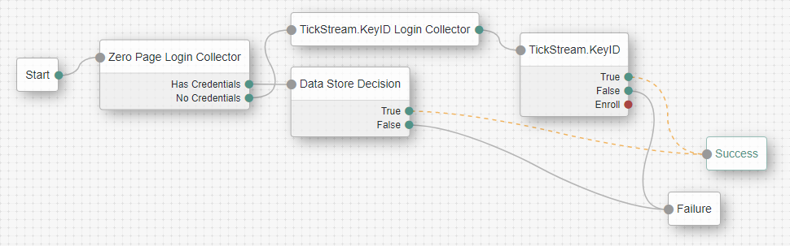
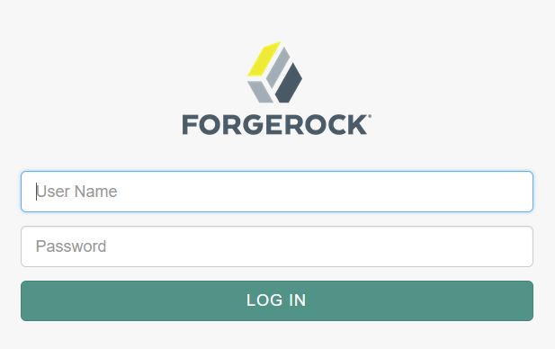

<!--
 * The contents of this file are subject to the terms of the Common Development and
 * Distribution License (the License). You may not use this file except in compliance with the
 * License.
 *
 * You can obtain a copy of the License at legal/CDDLv1.0.txt. See the License for the
 * specific language governing permission and limitations under the License.
 *
 * When distributing Covered Software, include this CDDL Header Notice in each file and include
 * the License file at legal/CDDLv1.0.txt. If applicable, add the following below the CDDL
 * Header, with the fields enclosed by brackets [] replaced by your own identifying
 * information: "Portions copyright [year] [name of copyright owner]".
 *
 * Copyright ${data.get('yyyy')} ForgeRock AS.
-->
# TickStream.KeyID Authentication Node

**PREVIEW RELEASE** of an authentication node for ForgeRock's [Identity Platform][forgerock_platform] that protects the login process with TickStream.KeyID. With TickStream.KeyID a user's typing behavior can be passively or actively enrolled and evaluated to provide an advanced second factor behavioral biometric. For more information visit <http://www.intensityanalytics.com>

For evaluation licenses please contact <sales@intensityanalytics.com>

## BUILD ##

The code in this repository has binary dependencies that live in the ForgeRock maven repository. Maven can be configured to authenticate to this repository by following the following [ForgeRock Knowledge Base Article](https://backstage.forgerock.com/knowledge/kb/article/a74096897).

## Installation ##
Copy the .jar file from the ../target directory into the ../webapps/openam/WEB-INF/lib directory where AM is deployed. Restart the AM service to load the TickStream.KeyID authentication tree node. The TickStream.KeyID components will then be available for use in the Authenticaton Tree designer.

## USAGE ##

To protect logins with TickStream.KeyID you must configure the Authentication Tree to use the TickStream.KeyID Login Form and TickStream.KeyID nodes.

The TickStream.KeyID Login Form node captures typing behavior metrics using JavaScript and stores it in a shared state variable. You may customize the path to the TickStream.KeyID JavaScript library.

The TickStream.KeyID node evaluates the login data captured by the login form. Typically the node is placed after the password has been authenticated. You must provide the webservice URL and authentication key for your TickStream.KeyID server. There are several additional configuration operations that let you customize the login process.

Option | Description
-- | --
Timeout | TickStream.KeyID web service timeout
Strict SSL | Enforce web service SSL certificates
Passive Validation | Collect and evaluate typing behavior but always allow the user access
Passive Enrollment | Collect and evaluate typing behavior over subsequent logins
Custom Threshold | Provide a custom threshold different than the TickStream.KeyID server setting
Threshold Confidence | Custom threshold confidence value (integer)
Threshold Fidelity | Custom threshold fidelity value (integer)
Grant On Error | Allow access if there is an error communicating with the TickStream.KeyID web service 

## TROUBLESHOOTING ##

Errors, warnings and messages are logged in the `openam/openam/debug/KeyIDNode` file. You may configure the logging level in AM by going to the `openam/Debug.jsp` page. Only errors are logged when the AM service is started by default.

## DISCLAIMER ##

The sample code described herein is provided on an "as is" basis, without warranty of any kind, to the fullest extent permitted by law. Intensity Analytics does not warrant or guarantee the individual success developers may have in implementing the sample code on their development platforms or in production configurations.

Intensity Analytics does not warrant, guarantee or make any representations regarding the use, results of use, accuracy, timeliness or completeness of any data or information relating to the sample code. Intensity Analytics disclaims all warranties, expressed or implied, and in particular, disclaims all warranties of merchantability, and warranties related to the code, or any service or software related thereto.

Intensity Analytics shall not be liable for any direct, indirect or consequential damages or costs of any type arising out of any action taken by you or others related to the sample code.

[forgerock_platform]: https://www.forgerock.com/platform/  
